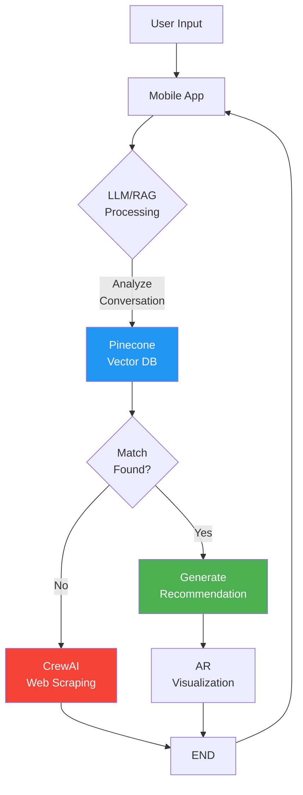

# Ablakash
AI-Powered Furniture Recommendation & Augmented Reality Visualization
Revolutionizing interior design with intelligent furniture recommendations and immersive AR experiences.


## Progress: currently working on it and due to our limited quota in Azure, **I will close the server in 25/2/2026**

## Frontend repo: https://github.com/MohamedREDA-24/AR_APP
## APK Link: [https://qr.me-qr.com/gOSg8ov9](https://drive.google.com/file/d/1g1YO1wSseR9Uzukzkmi7j8wNo9RDh3nf/view?usp=drive_link)

### Built With
[![FastAPI][FastAPI-badge]][FastAPI-url]
[![CrewAI][CrewAI-badge]][CrewAI-url]
[![Pinecone][Pinecone-badge]][Pinecone-url]
[![FAISS][FAISS-badge]][FAISS-url]
[![Florence-2-large][Florence-badge]][Florence-url]
[![TRELLIS][TRELLIS-badge]][TRELLIS-url]
[![Gemini LLM][Gemini-badge]][Gemini-url]
[![BLIP][BLIP-badge]][BLIP-url]
[![Kotlin][Kotlin-badge]][Kotlin-url]
[![Azure][Azure-badge]][Azure-url]

[FastAPI-badge]: https://img.shields.io/badge/FastAPI-009688?style=for-the-badge&logo=fastapi&logoColor=white
[FastAPI-url]: https://fastapi.tiangolo.com/

[CrewAI-badge]: https://img.shields.io/badge/CrewAI-6C757D?style=for-the-badge&logo=ai&logoColor=white
[CrewAI-url]: https://crewai.com/

[Pinecone-badge]: https://img.shields.io/badge/Pinecone-0080FF?style=for-the-badge&logo=pinecone&logoColor=white
[Pinecone-url]: https://www.pinecone.io/

[FAISS-badge]: https://img.shields.io/badge/FAISS-6600CC?style=for-the-badge&logo=facebook&logoColor=white
[FAISS-url]: https://faiss.ai/

[Florence-badge]: https://img.shields.io/badge/Florence--2--large-006699?style=for-the-badge&logo=microsoft&logoColor=white
[Florence-url]: https://huggingface.co/microsoft/florence-2-large

[TRELLIS-badge]: https://img.shields.io/badge/TRELLIS-00A65A?style=for-the-badge&logo=3d&logoColor=white
[TRELLIS-url]: https://huggingface.co/spaces/JeffreyXiang/TRELLIS

[Gemini-badge]: https://img.shields.io/badge/Gemini-4285F4?style=for-the-badge&logo=google&logoColor=white
[Gemini-url]: https://aistudio.google.com/

[BLIP-badge]: https://img.shields.io/badge/BLIP-4CAF50?style=for-the-badge&logo=ai&logoColor=white
[BLIP-url]: https://huggingface.co/Salesforce/blip

[Kotlin-badge]: https://img.shields.io/badge/Kotlin-0095D5?style=for-the-badge&logo=kotlin&logoColor=white
[Kotlin-url]: https://kotlinlang.org/

[Azure-badge]: https://img.shields.io/badge/Azure-0078D4?style=for-the-badge&logo=microsoftazure&logoColor=white
[Azure-url]: https://azure.microsoft.com/


## Getting Started
## Overview
Ablakash is an AI-driven platform that transforms how users discover and visualize furniture for their spaces. Leveraging Large Language Models (LLMs) and Retrieval-Augmented Generation (RAG), the system analyzes user conversations to recommend optimal furniture from a curated database. If no match is found, it employs CrewAI for web scraping and searching across external sources.

The platform integrates Augmented Reality (AR) to project 3D furniture models into users' rooms in real-time, enabling immersive visualization. Additionally, it provides tailored recommendations, including complementary furniture options to complete room designs. Deployed as a mobile app, Ablakash delivers a seamless, end-to-end experience for personalized interior design.
## Use Case Diagram


## Key Features

- Intelligent Recommendations:
   - Leverages LLM prompt engineering and RAG to analyze user preferences and recommend furniture.
   - Uses CrewAI for web scraping and external searches when no match is found in the database.
   - Fine-tuned with QLoRA for efficient, low-resource adaptation to specific user needs.

- Immersive AR Visualization:
   - Projects 3D furniture models into users' rooms using real-time imagery.
   - Enhances decision-making with lifelike previews of furniture in the user's space.

- Tailored Descriptions:
   - Generates detailed, personalized recommendations, including complementary furniture options.
   - Ensures cohesive room designs with style-matching suggestions.

- Scalable Backend:

   - Utilizes Pinecone for vector search, enabling fast and accurate retrieval of furniture options.
   - Deployed as a mobile app for on-the-go accessibility (using Kotlin).


## 🛠️ Technical Details 
- Implemented a RAG pipeline using MPNet-Base-V2 for attribute extraction, embedding generation, and retrieval via Pinecone.
- Designed a conversation state model with distinct phases: feature collection, recommendation, awaiting alternatives, ending, and restart confirmation.
- Integrated CrewAI agents for automated furniture search, utilizing TavilyClient for web-based retrieval.
- Enhanced AI-driven interpretation using BLIP + Gemini, enabling image-based feature extraction and furniture recommendation.
- Developed AR functionality for real-time 3D visualization and personalized recommendations in a mobile app.
- Currently working on fine-tuning the model using QLoRA for improved performance.

## Key Additions Explained (Dataset Creation)
- 1.IKEA-Specific Scraping:
    - Targeted scraping of IKEA's product catalog for high-quality furniture data.
    - Extracted metadata (dimensions, materials, styles) to enrich the recommendation engine.
- 2.Florence-2-Large:
    - Replaced BLIP with Florence-2-Large for advanced image captioning.
    - Generates detailed descriptions (e.g., "beige chaise lounger with modern styling") for better feature extraction.
- 3.Trellis 3D Engine:
    - Integrated Trellis for real-time 3D rendering of furniture models.
    - Enables AR visualization with accurate spatial placement in user environments.


## Another Solution 
We implement a modular agent framework :
- Chat Agent: Manages user interaction and intent detection
- RAG Agent: Leverages Pinecone for semantic retrieval of furniture data
- Web Scraper Agent: Fallback search via Tavily API when local matches fail
- Router Function: Orchestrates agent workflow based on image-derived attributes (wall color, room dimensions, style)
- **APK Link**: [https://qr.me-qr.com/gOSg8ov9](https://drive.google.com/drive/folders/1B5peiR1DMgpQquF19WnsrTn-BOL5U8ss)

## 📱 Mobile Backend Integration
Kotlin Mobile App → FastAPI Middleware → Azure Cloud Services
- Mobile requests are routed through a FastAPI layer for preprocessing
- Azure handles scaling, authentication, and real-time response orchestration
### Prerequisites
Ensure you have the following installed:
- Python 3.12
- FastAPI
- Uvicorn
- Pinecone client
- Kotlin (for mobile app development)

  
### Installation

1. Clone the repository:
   ```sh
   git clone https://github.com/MrSa3dola/AR_RAG.git
   cd AR_RAG
   ```

2. Create and activate a virtual environment:
   ```sh
   python -m venv venv
   source venv/bin/activate  # On Windows use `venv\Scripts\activate`
   ```

3. Install dependencies:
   ```sh
   pip install -r requirements.txt
   ```

4. Run the FastAPI backend:
   ```sh
   uvicorn main:app --host 0.0.0.0 --port 8000
   ```

